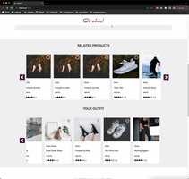
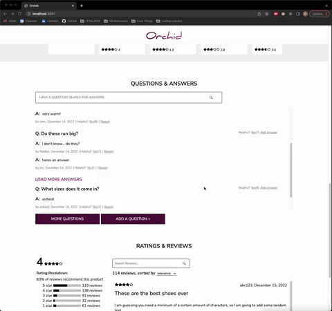
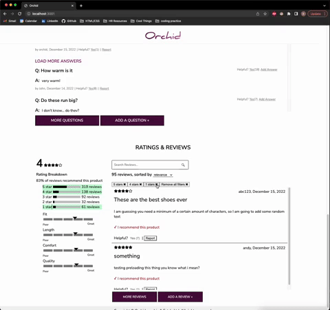

# Orchid

Orchid is a minimalistic yet elegant single-page shopping website designed to promote an intuitive, straightforward user experience. This project was completed over the course of three weeks by a team of 4 students for the front end capstone portion of Hack Reactor’s software engineering immersive program.


## Tech Stack


## Demo
[Demo video](https://drive.google.com/file/d/1wLdJBAAHJ47SlWK1v0Px5dhedl-X-7Kl/view?usp=share_link)


## Component Details
### Product Overview
This component will guide the customer through selecting a specific style and size to add to their cart. For each product, an image gallery, the product information, a style/size selector, and an add to cart button is displayed.


### Related Items & Comparison
This component displays a related product list consisting of products related to the currently viewed product and an outfit list consisting of the products that the user added. Each related product card renders a comparison modal window, and each outfit card can be deleted from the outfit list. For both lists, clicking on a card navigates to the detail page for that product.


### Questions & Answers
This component gives the user the ability to view and search questions, ask questions, answer questions, and provide feedback on questions about the current product.


### Ratings & Reviews
This component gives users the ability to see ratings breakdown and all reviews for the product chosen. Reviews can be filtered by stars, searching keywords or choosing a sort by value. Users can also write a new review or provide feedback (vote as helpful or report) on existing reviews by interacting with the action buttons.



## Installation & Use
1. Clone the repo
    ```
    git clone https://github.com/rfe2210-FEC-Orchid/FrontEndCapstone.git
    ```
2. Install all required packages
    ```
    npm install
    ```
3. Rename `example.config.js` to `config.js`
4. Create a github personal access token to acquire access to the API and insert the token into `config.js`
5. Compile the client-side code with webpack
   ```
   npm run client-dev
   ```
6. Start the server
   ```
   npm run server-dev
   ```
7. Navigate to localhost:3001
